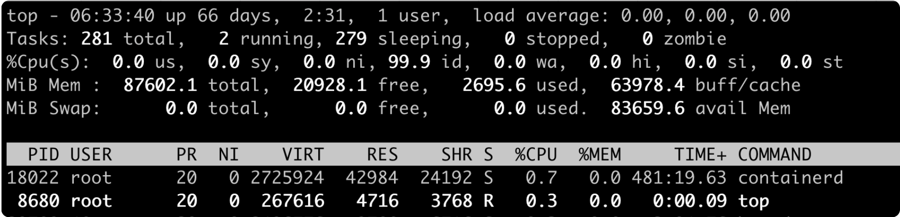
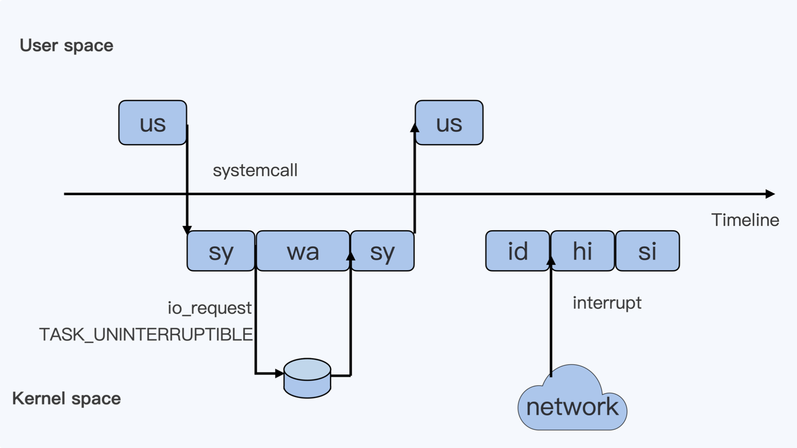

[Toc]


### docker Namespace

```
Cgroup(control Groups)：可以对指定的进程做各种计算机资源的限制，比如限制CPU的使用率，内存使用量，IO设备的流量等等
 * CPU子系统，用来限制一个控制组（一组进程，可以理解为一个容器里的所有进程）可使用的最大CPU。
 * memory子系统，用来限制一个控制组最大的内存使用量。
 * pids子系统，用来限制一个控制组里最多可以运行多少个进程。
 * cpuset子系统，这个子系统用来限制一个控制组里的进程可以在哪几个物理CPU上运行。
```

```json
ipc
network
mount
pid
time
user
uts
```

##### PID Namespace

> 负责隔离不同容器的进程

##### Network Namespace

> 负责管理网络环境的隔离

##### Mount Namespace

> 管理文件系统的隔离 

```
PID
```

##### Namespace和Cgroups的区别

>   Namespace帮助容器来实现各种计算资源的隔离，Cgroups主要限制的是容器能够使用的某种资源量。

容器其实就是Namespace + Cgroups


##### 进程处理信号的三种选择

| --             | --                                               |
| -------------- | ------------------------------------------------ |
| 忽略（Ignore） | 对信号不做任何处理，但 SIGKILL 和 SIGSTOP 例外。 |
|捕获（Catch） | 让用户进程可以注册自己针对这个信号的handler，但 SIGKILL 和 SIGSTOP例外。|
| 缺省（Default） | Linux为每个信号都定义一个缺省的行为。对于大部分的信号，应用程序不需要注册自己的handler，使用系统缺省定义行为即可。 |

> **进程对每种信号的处理，包括上面三个选择：调用系统缺省行为、捕获、忽略。**

```json
第一个选择就是缺省，如果我们在代码中对某个信号，比如SIGTERM信号，不做任何 signal() 相关的系统调用，那么在进程运行的时候，如果接受到信号 SIGTERM，进程就会执行内核中 SIGTERM 信号的缺省代码。

内核中对不同的信号有不同的缺省行为，一般会采用退出（terminate），暂停（stop），忽略（ignore）这三种行为中的一种。
对于 SIGTERM 这个信号来说，它的缺省行为就是进程退出（terminate）。


第二个选择捕获，捕获指的就是我们在代码中为某个信号，调用 signal() 注册自己的handler。这样进程在运行的时候，一旦接受到信号，就不会再去执行内核中的缺省代码，而是会执行通过 signal() 注册的handler。


第三个选择忽略，如果要让进程“忽略”一个信号，我们就要通过 signal() 这个系统调用，为这个信号注册一个特殊的handler，也就是 SIG_IGN.
```

> **SIGKILL 和 SIGSTOP 信号是两个特权信号，它们不可以被捕获和忽略，这个特点也反映在 signal() 上**

Q：怎么解决停止容器的时候，容器内应用程序被强制杀死的问题？

A：**解决的方法就是在容器的init进程中对收到的信号做个转发，发送到容器中的其他子进程，这样容器中的所有进程在停止的时候，都会收到 SIGTERM，而不是 SIGKILL信号了。**


#### docker僵尸进程

##### docker容器控制进程数

> 在一个容器建立之后，创建容器的服务会在 /sys/fs/cgroup/pids 下建立一个子目录，就是一个控制组，控制组里**最关键的一个文件就是pids.max。** 我们可以向这个文件写入数值，而这个值就是这个容器中允许的最大进程数目。


```json
残留的僵尸进程，在容器里仍然占据着进程号资源，很可能会导致新的进程不能运转
```

```json
僵尸进程产生的原因：父进程在创建完子进程之后就不管了，这就是造成子进程变成僵尸进程的原因。需要父进程调用 wait() 或者 waitpid() 系统调用来避免僵尸进程产生。
```

###### 关于僵尸进程

1. 每一个 Linux 进程在退出的时候都会进入一个僵尸状态（EXIT_ZOMBIE);
2. 僵尸进程如果不清理，就会消耗系统中的进程数资源，最坏的情况是导致新的进程无法启动。
3. 僵尸进程一定需要父进程调用 wait() 或者 waitpid() 系统调用来清理，这样是容器中 init 进程必须具备的一个功能。


#### docker cpu


通过 top 命令查看服务器 CPU 情况



在截图第三行，每一项值的意思分别是：

###### CPU Usage 一览表

| 类型 | 具体含义 |
|--|--|
| us | User，用户态CPU时间，不包括低优先级进程的用户态时间（nice值 1- 19）|
| sys | System，内核态 CPU 时间 |
| ni | Nice，nice值 1-19 的进程用户态 CPU 时间 |
| id | Idle，系统空闲 CPU 时间 |
| wa | Iowait，系统等待 I/O 的 CPU 时间，这个时间不计入进程CPU 时间 |
| hi | Hardware irq，处理硬中断的时间，这个时间不计入进程 CPU 时间 |
| si | Softirq，处理软中断的时间，这个时间不计入进程 CPU 时间 |
| st | Steal，表示同一个宿主机上的其他虚拟机抢走的 CPU 时间 |


转化为用户图为：



###### 用户态和内核态cpu切换

```json
1.假设一个用户程序开始运行，那么久对应着第一个"us"框，"us"是"user"的缩写，代表Linux的用户态CPU Usage。
2.当这个用户程序代码中调用了系统调用，比如说read()去读取一个文件，这时候这个用户进程就会从用户态切换到内核态。内核态 read() 系统调用在读到真正 disk 上的文件前，就会进行一些文件系统层的操作。那么这些代码指令的消耗就属于"sy",这里就对应上面图里的第二个框。"sy"是"system"的缩写，代表内核态 CPU 使用。
3.接下来，这个 read() 系统调用会向 linux 的 Block Layer 发出一个 I/O Request，触发一个真正的磁盘读取操作。这时候，这个进程一般会被置为 TASK_UNINTERRUPTIBLE。而Linux会把这段时间标示成"wa",对应图里的第三个框，"wa"是"wait"的缩写，代表等待I/O的时间，这里的 I/O指 Disk I/O。
4.当磁盘返回数据时，进程在内核态拿到数据，这里仍旧是内核态的CPU使用中的，所以还是"sy"状态。
5.进程再从内核态切换到用户态，在用户态得到文件数据，这里进程又回到用户态的CPU使用，变成"us"状态。
```

###### network的cpu状态

```json
1.假设，这个用户进程读取数据之后，没事可做就进入休眠状态了，并且这时在这个CPU上也没有其他需要运行的进程了，那么系统就会进入"id"这个步骤，"id"是"idle"的缩写，代表系统处于空闲状态。
2.如果这时这台机器在网络收到一个网络数据包，网卡就会发出一个中断(interrupt)。相应的，CPU会响应中断，然后进入中断服务程序。这时CPU就会进入"hi"，也就是第七个框，"hi"是"hardware irq"的缩写，代表CPU处理硬中断的开销。由于我们的中断服务处理需要关闭中断，所以这个硬中断的时间不能太长。
3.但是，发生中断后的工作是必须要完成的，Linux中有一个软中断的概念（softirq），它可以完成这些耗时比较长的工作。可以这样理解软中断，从网卡到收到数据包的大部分工作，都是通过软中断来处理的。那么cpu就会进入到第八个框，"si",这里是"softirq"的缩写，代表CPU处理软中断的开销。
*注意：无论是"hi"还是"si"，它们的CPU时间都不会计入进程的CPU时间。这是因为本身它们在处理的时候就不属于任何一个进程。*
```


