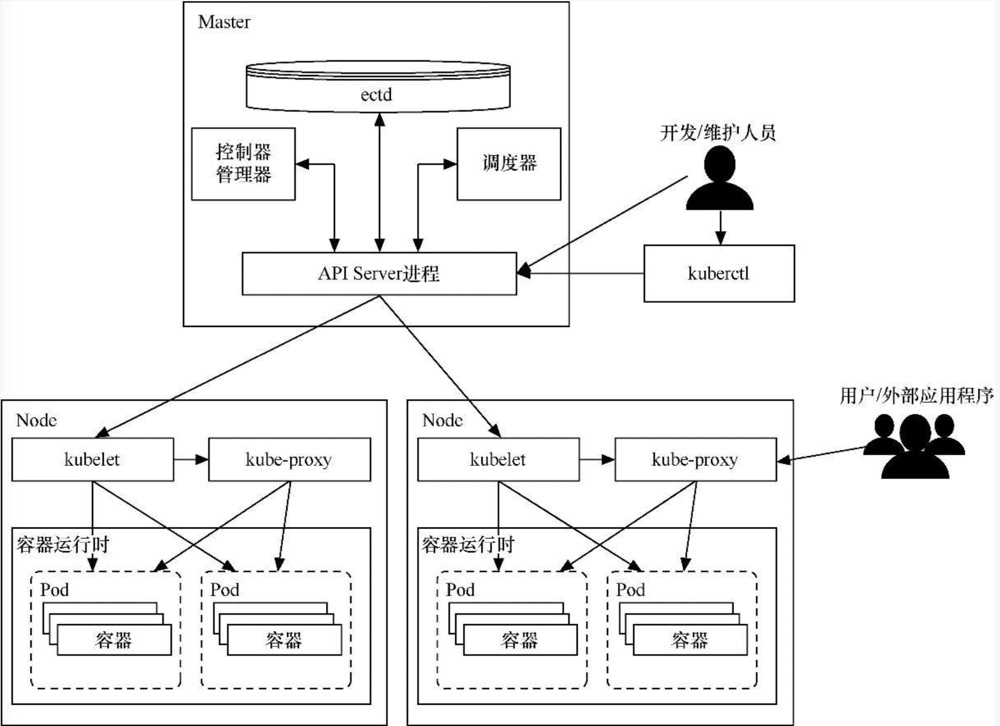
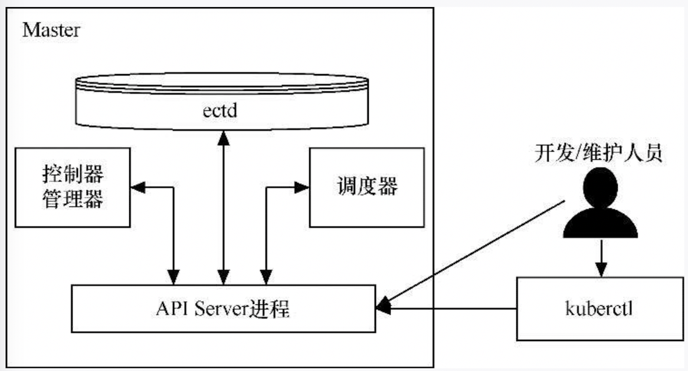
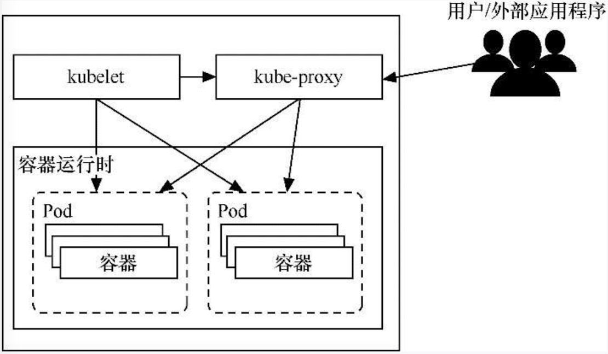
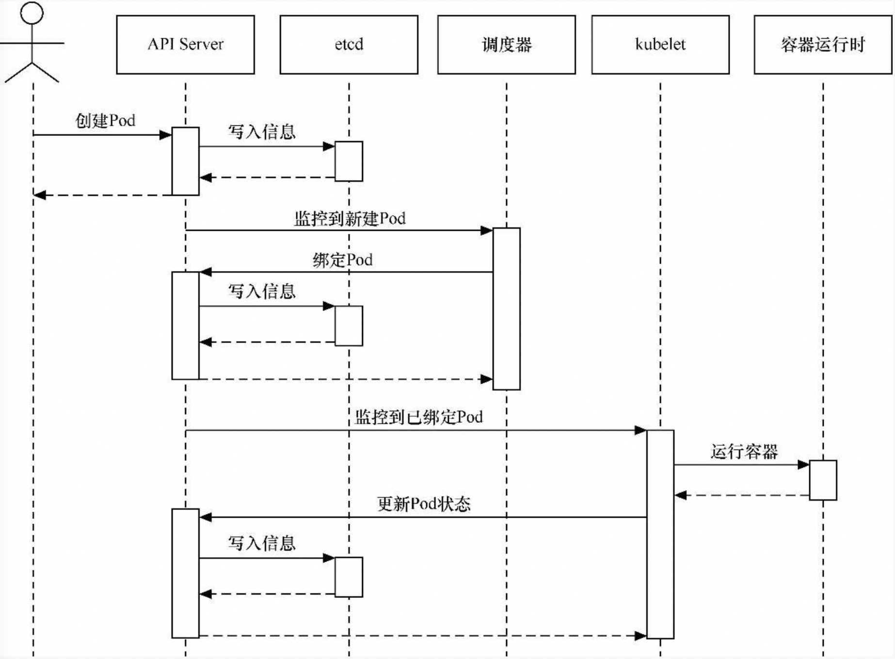
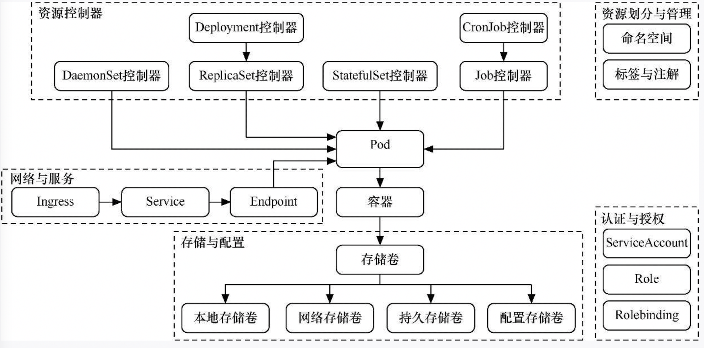
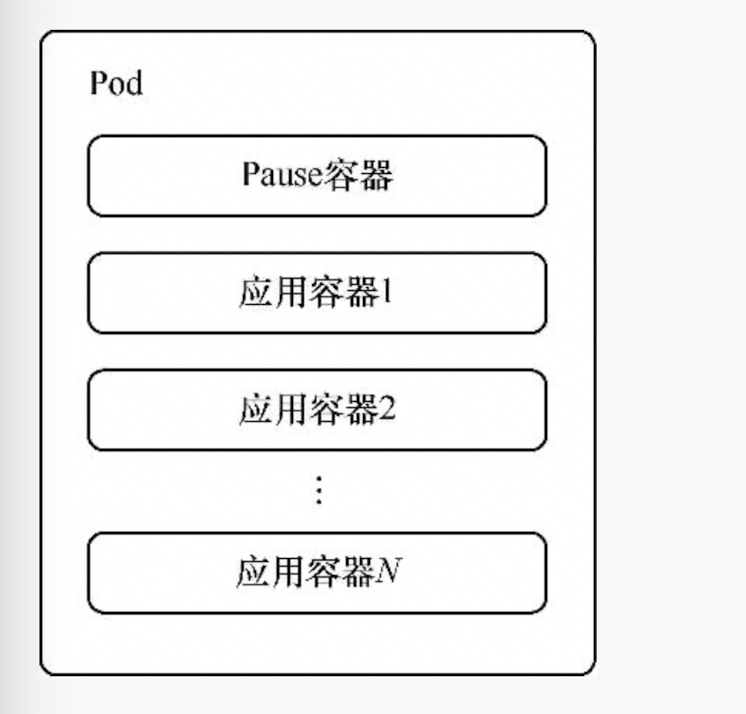
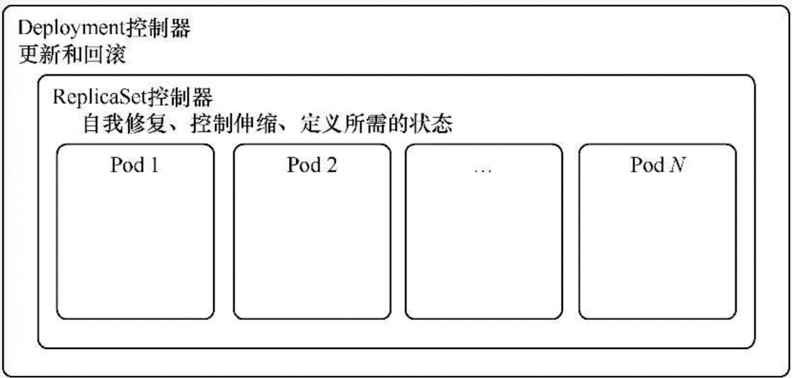
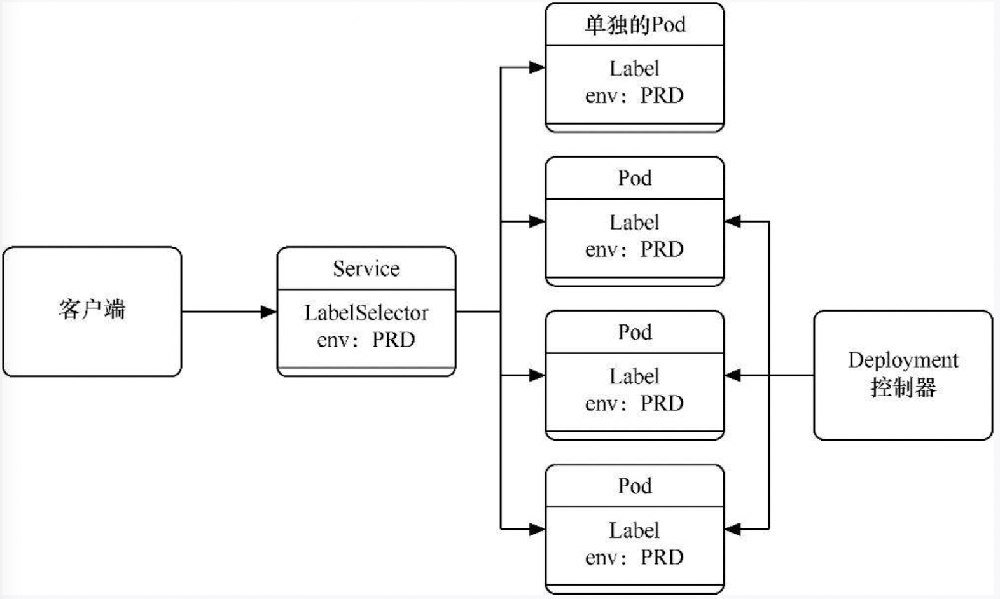
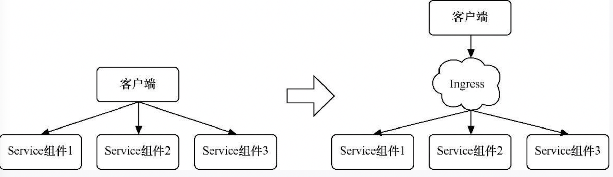
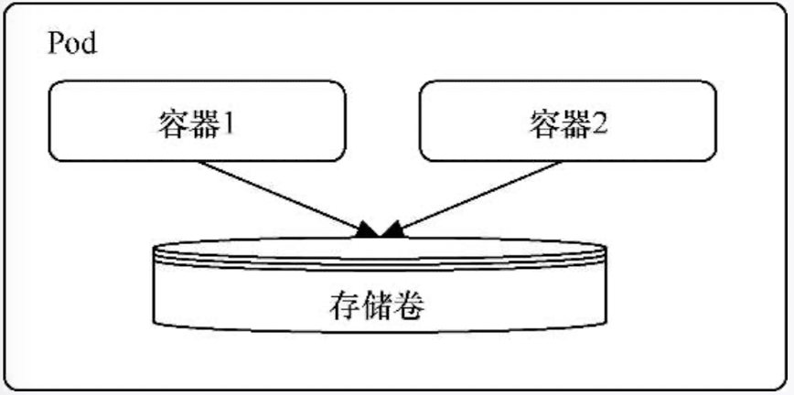

[TOC]

### k8s概念：

​	在kubernetes集群中，有master和node两个角色。

```json
Master主要负责整个集群的管理控制。
Node负责集群中的各个工作节点。Node由Master管理，提供运行容器所需的各种环境，对容器进行实际的控制，而这些容器会提供实际得到应用服务。
```



#### Master
**Master的组成**


> 注意：图里的ectd应该为etcd

###### 1.API Server进程

```json
API Server(kube-apiserver)进程为kubernetes中各类资源对象提供了增删改查等HTTP REST接口。
```

###### 2.etcd
```json
etcd是一种轻量级的分布式键值存储。只有API Server进程才能直接访问和操作etcd。
```

###### 3.调度器（kube-scheduler）
```json
调度器（kube-scheduler）是Pod资源的调度器。它用于监听最近创建但还未分配 Node 的 Pod资源，会为 Pod自动分配相应的 Node。
调度器所执行的各项操作均是基于API Server进程的。如调度器会通过API Server进程的Watch接口监听新建的Pod，并搜索所有满足 Pod需求的Node列表，再执行Pod调度逻辑。调度成功后会将Pod绑定到目标Node上。
```

###### 4.控制器（kube-controller-manager）
```json
kubernetes集群的大部分功能是由控制器执行的。
* Node控制器：负责在Node出现故障时做出响应。
* Replication控制器：负责对系统中的每个ReplicationController对象维护正确数量的Pod。
* Endpoint控制器：负责生成和维护所有Endpoint对象的控制器。Endpoint控制器用于监听Service和对应的Pod副本的变化。
* ServiceAccount及Token控制器：为新的命名空间创建默认账户和API访问令牌。
kube-controller-manager所执行的各项操作也是基于API Server进程的。
```


#### Node
**Node的组成**



> Node由3个部分组成，分别是kubelet、kube-proxy和容器运行时(container runtime)。

###### 1.kubelet
```json
kubelet 是在每个Node上都运行的主要代理进程。kubelet以PodSpec为单位来运行任务，PodSpec是一种描述Pod的YAML或JSON对象。kubelet会运行各种机制提供（主要通过API Server）的一系列PodSpec，并确保这些PodSpec中描述的容器健康运行。kubelet负责维护容器的生命周期，同时也负责存储卷（volume）等资源的管理。

每个Node上的kubelet会定期调用Master节点上API Server进程的REST接口，报告自身状态。API Server进程接受这些信息后，会将Node的状态信息更新到etcd中。kubelet也通过API Server进程的Watch接口监听Pod信息，从而对Node上的Pod进行管理。
```

###### 2.kube-proxy
```json
kube-proxy主要用于管理Service的访问入口，包括集群内的其他Pod到Service的访问，以及从集群外访问Service。
```

###### 3.容器运行时
```json
容器运行时是负责运行容器的软件。
```


##### Pod创建流程



具体发生的事情如下：
```json
（1）kubectl命令将转换为对API Server的调用。
（2）API Server验证请求并将其保存到etcd中。
（3）etcd通知API Server。
（4）API Server调用调度器。
（5）调度器决定在哪个节点运行Pod，并将其返回给API Server。
（6）API Server将对应节点保存到etcd中。
（7）etcd通知API Server。
（8）API Server在相应的节点中调用kubelet。
（9）kubelet与容器运行时API发送交互，与容器守护进程通信以创建容器。
（10）kubelet将Pod状态更新到API Server中。
（11）API Server把最新的状态保存到etcd中。
```


###### kubernetes的基本对象模型



#### kubernetes主要的资源对象
##### Pod
```json
Pod是kubernetes处理的最基本单元。容器本身并不会直接分配到主机上，而是会封装到名为Pod的对象中。

Pod通常表示单个应用程序，由一个或多个关系紧密的容器构成，这些容器拥有同样的生命周期，作为一个整体一起编排到Node上。这些容器共享环境、存储卷和IP空间。尽管Pod基于一个或多个容器，但应将Pod视为单一的整体、单独的应用程序。kubernetes以Pod为最小单元进行调度、伸缩并共享资源、管理生命周期。

一般来说，用户不应自行管理Pod，因为Pod并没有提供应用程序通常会用到的一些特性，如复杂的生命周期管理及动态伸缩。建议用户使用将Pod或Pod模板作为基本组件的更高级别对象，这些对象会拥有更多的特性。
```



> Pod容器的构成

##### 控制器

> 一般来说，用户不会直接创建Pod，而是创建控制器，让控制器来管理Pod。


1. RelicationController和RelicaSet控制器
```json
ReplicationController可以定义Pod模板，并可以设置相应控制参数以实现水平伸缩，以调节正在运行的相同的Pod数。ReplicationController能根据需要自动创建新的Pod。
ReplicationController负责保证在集群中部署的Pod数量与配置中的Pod数量一致。如果Pod或主机出现故障，ReplicationController会自动启动新的Pod进行补充。如果ReplicationController配置中的副本数量发生改变，则会启动或终止一些Pod来匹配设定好的数量。ReplicationController还可以执行滚动更新，将一组Pod逐个切换到最新版本，从而最大限度减少对应用程序可用性的影响。

ReplicaSet控制器可以看作ReplicationController的另一个版本，其Pod识别功能使它在Pod管理上更具灵活性。由于ReplicaSet控制器具有副本筛选功能，因此ReplicaSet控制器才有逐渐取代ReplicationController的趋势，但ReplicaSet控制器无法实现滚动更新，无法像ReplicationController那样在后端轮流切换到最新版本。

与Pod一样，ReplicationController和ReplicaSet控制器都是很少直接使用的对象。虽然它们都是基于Pod而设计的，增加了水平伸缩功能，提高了可靠性，但它们缺少一些在其他复杂对象中具有的更细粒度的生命周期管理功能。

```


2. Deployment控制器
```json
Deployment控制器可能是最常用的工作负载对象之一。Deployment控制器以ReplicaSet控制器为基础，是更高级的概念，增加了更灵活的生命周期管理功能。

Deployment控制器是一种高级对象，旨在简化Pod的生命周期管理。只要简单更改Deployment控制器的配置文件，Kubernetes就会自动调节ReplicaSet控制器，管理应用程序不同版本之间的切换，还能实现自动维护事件历史记录及自动撤销功能。
```




3. StatefulSet控制器
```json
StatefulSet控制器是一种提供了排序和唯一性保证的特殊Pod控制器。当有与部署顺序、持久数据或固定网络等相关的特殊需求时，可以使用StatefulSet控制器来进行更细粒度的控制。StatefulSet控制器主要用于有状态的应用。

StatefulSet控制器为每个Pod创建唯一的、基于数字的名称，从而提供稳定的网络标识符。即使要将Pod转移到另一个节点，该名称也将持续存在。同样，当需要重新调度时，可以通过Pod转移持久性数据卷。即使删除了Pod，这些卷也依然存在，以防止数据意外丢失。

Deployment控制器下的每一个Pod都毫无区别地提供服务，但StatefulSet控制器下的Pod则不同。虽然各个Pod的定义是一样的，但是因为其数据的不同，所以提供的服务是有差异的。
```

4. DaemonSet控制器
```json
DaemonSet控制器是另一种特殊的Pod控制器，它会在集群的各个节点上运行单一的Pod副本。DaemonSet控制器非常适合部署那些为节点本身提供服务或执行维护的Pod。
```

5. Job控制器和CronJob控制器
```json
上述的各类工作负载对象都是长期运行的，拥有服务级的生命周期。Job控制器基于特定任务而运行，当运行任务的容器完成工作后，Job就会成功推出。如果需要执行一次性的任务，而非提供连续的服务，Job控制器非常适合。

CronJob控制器在Job控制器的基础上增加了时间调度，可以在给定的时间点运行一个任务，也可以周期性地在给定时间点运行一个任务。
```


#### 服务与存储
##### Service组件和Ingress
```json
在kubernetes中，Service是内部负载均衡器中的一种组件，会将相同功能的Pod在逻辑上组合到一起，让它们表现得如同一个单一的实体。

之前介绍的各个工作负载对象只保证了支撑服务的微服务Pod的数量，但是没有解决如何访问这些服务的问题。Pod只是一个运行的应用实例，随时可能在一个节点上停止，并在另一个节点使用新的IP地址启动新的Pod，因此Pod根本无法以固定的IP地址和端口号提供服务。

通过Service组件可以发布服务，可以跟踪并路由到所有指定类型的后端容器。内部使用者只需要知道Service组件提供的稳定端点即可进行访问。另外，Service组件抽象可以根据需要来伸缩或替换后端的工作单元，无论Service组件具体路由到哪个Pod，其IP地址都保持稳定。
```



> 通过Service组件访问Pod

```json
每当需要给另一个应用程序或外部用户提供某些Pod的访问权限时，就可以配置一个Service组件。

还可以通过Ingress来整合Service组件。Ingress并不是某种服务类型，可以充当多个Service组件的统一入口。Ingress支持将路由规则合并到单个资源中，可以通过同一域名或IP地址下不同路径来访问不同的Service组件。
```



> 通过Ingress整合Service组件


##### 存储卷和持久存储卷
```json
kubernetes定义了自己的存储卷（volume），允许Pod中的所有容器共享数据，并在Pod终止之前一直保持可用。这意味着紧密耦合的Pod可以轻松共享文件而不需要复杂的外部机制，Pod中的容器故障不会影响对共享文件的访问。但是Pod终止后，共享的存储卷会被销毁，不利于真正需要持久化的数据。
```




```json
持久存储卷（persistent volume）是一种更健壮的抽象机制，不依赖于Pod的生命周期。持久存储卷允许管理员为集群配置存储资源，用户可以为正在运行的Pod请求和声明存储资源。带有持久存储卷的Pod一旦使用完毕，存储卷的回收策略将决定是保留存储卷（直到手动删除），还是立即删除数据。持久性数据可预防节点级的故障，并分配比本地更多的可用存储空间。
```

#### 资源划分
##### 命名空间
```json
命名空间（namespace）的主要作用是对kubernetes集群资源进行划分。这种划分并非物理划分而是逻辑划分，用于实现多租户的资源隔离。
```


> 使用命名空间隔离资源

##### 标签和注解
```json
kubernetes中的标签（label）是一种语义化标记，可以附加到kubernetes对象上，对它们进行标记或划分。如果要针对不同的实例进行管理或路由，可以用标签来进行选择。

标签的形式是键值对，每个单元可以拥有多个标签，但每个单元对于键只能拥有一个值。

注解（annotation）也是一种类似的机制，用于将任意键值信息附加到某一对象中。相对于标签，注解更灵活，可以包含少量结构化数据。一般来说，注解只是向对象添加更多元数据的一种方式，但并不用于筛选。
```

#### 小结
* kubernetes集群主要由Master和Node组成。Master管理Node，Node管理容器。
* Master的主要组件分别为kube-apiserver(负责实际操作)、etcd（负责存储）、kube-scheduler（负责Pod调度）、kube-controller-manager（负责对象管理）
* Node的主要组件分别为kubelet（值守进程）、kube-proxy（负责服务发现）和容器运行时（负责操作容器）。
* kubernetes以Pod为最小单位进行调度、伸缩并共享资源、管理生命周期。
* 控制器中定义了Pod的部署方式，如有多少个副本、需要在哪种Node上运行等。根据不同的业务场景，kubernetes提供了多种控制器，如ReplicationController、ReplicaSet控制器、Deployment控制器、StatefulSet控制器、DaemonSet控制器、Job控制器和CronJob控制器。
* Service是内部负载均衡器中的一种组件，会将相同功能的Pod在逻辑上组合到一起，让它们表现得如同一个单一的实体。
* kubernetes定义了自己的存储卷抽象，允许Pod中的所有容器共享数据，在Pod终止之前一直保持可用。而持久存储卷是一种更健壮的抽象机制，不依赖于Pod的生命周期。
* Label是一种语义化标签，可以附加到kubernetes对象上，对它们进行标记或划分。


* Pod：
  * Pod是k8s里能够被运行的最小的逻辑单元（原子单元）
  * 1个Pod里面可以运行多个容器，它们共享UTS+NET+IPC名称空间
  * 可以把Pod理解成豌豆荚，而同一个Pod内的每个容器是一颗颗豌豆
  * 一个Pod里面可以运行多个容器，又叫边车模式
* Pod控制器：
  * Pod控制器是Pod启动的一个模板，用来保证在k8s里启动的Pod应始终按照人们的预期运行（副本数、生命周期、健康状态检查。。。）
  * k8s内提供了众多的pod控制器，常用的有如下几种:
    * Depolyment
    * DaemonSet
    * ReplicaSet
    * StatefulSet
    * Job
    * CronJob
* Name:
  * 由于k8s内部，使用”资源“来定义每一种逻辑概念（功能），所以每种”资源“，都应该有自己的名称
  * ”资源"有api版本（apiVersion）、类别（kind）、元数据（metadata）、定义清单（spec）、状态（status）等配置信息
  * “名称”通常定义在“资源“的”元数据“信息里
* NameSpace：
  * 随着项目增多、人员增加、集群规模的扩大，需要一种能够隔离k8s内各种”资源“的方法，这就是==名称空间==
  * 名称空间可以理解为k8s内部的虚拟集群组
  * 不同名称空间内的”资源“，名称可以相同，相同名称空间内的”资源“，名称不能相同
  * 合理的使用k8s的名称空间，使得集群管理员能够更好的对交付到k8s里的服务进行分类管理和浏览
  * k8s里默认存在的名称空间有：default、kube-system、kube-public
  * 查询k8s里特定”资源“要带上相应的名称空间
* Label：
  * 标签是k8s特色的管理方式，便于分类管理资源对象
  * 一个标签可以对应多个资源，一个资源也可以有多个标签，它们是多对多的关系
  * 一个资源拥有多个标签，可以实现不同维度的管理
  * 标签的组成：key=value
  * 与标签类似的，还有一种注解（annotations）
* Label选择器：
  * 给资源打上标签后，可以使用标签选择器过滤指定的标签
  * 标签选择器目前有两个：基于等值关系（等于、不等于）和基于集合关系（属于、不属于、存在）
  * 许多资源支持内嵌标签选择器字段
    * matchLabels
    * matchExpressions
* Service:
  * 在k8s的世界里，虽然每个Pod都会被分配一个单独的ip地址，但这个ip地址会随着Pod的销毁而消失
  * Service（服务）就是用来解决这个问题的核心概念
  * 一个Service可以看作一组提供相同服务的Pod的对外访问接口
  * Service作用于哪些pod是通过标签选择器来定义的
* Ingress：
  * Ingress是k8s集群里工作在OSI网络参考模型下，第7层的应用，对外暴露的接口
  * Service只能进行L4流量调度，表现形式是ip+port
  * Ingress则可以调度不同业务域，不同URL访问路径的业务流量


##### 核心组件：
* 配置存储中心 -> etcd服务
* 主控（master）节点
    *  kube-apiserver服务
    *  kube-controller-manager服务
    *  kube-scheduler服务
* 远算（node）节点
    *  kube-kubelet服务
    *  kube-proxy服务
* CLI客户端
    * kubectl
* 核心附件
    * CNI网络插件 -> flannel/calico
    * 服务发现用插件 —>coredns
    * 服务暴露用插件 -> traefik
    * GUI管理插件 -> Dashboard