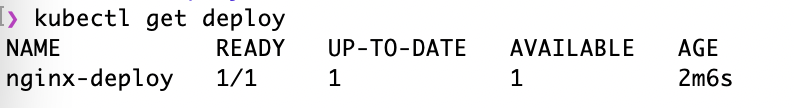

[toc]

#### kubernetes整体架构

#### Master

kubernetes里的master指的是集群控制节点，在每个kubernetes集群里都需要有一个Master来负责整个集群的管理和控制，基本上kubernetes的所有控制命令都要发给它，它负责具体的执行过程。

在Master上运行着以下关键进程：

* Kubernetes API Server（kube-apiserver）：提供了HTTP Rest接口的关键服务进程，是Kubernetes里所有资源的增、删、改、查等操作的唯一入口，也是集群控制的入口进程。
* Kubernetes Controller Manager（kube-controller-manager）：Kubernetes里所有资源对象的自动化控制中心，可以将其理解为资源对象的“大总管”。
* Kubernetes Scheduler（kube-scheduler）：负责资源调度（Pod调度）的进程。

#### Node

在Kubernetes中，除了Master节点，其他的机器被成为Node。Node是Kubernetes集群中的工作负载节点，每个Node都会被Master分配一些工作负载（Docker容器），当某个Node宕机时，其上的工作负载会被Master自动转移到其他节点上。

在每个Node上都运行着以下关键进程：

* **kubelet**：负责Pod对应的容器的创建、启停等任务，同时与Master密切协作，实现集群管理的基本功能。
* **kube-proxy**：实现Kubernetes Service的通信与负载均衡机制的重要组件。
* **Docker Engine（docker）**：Docker引擎，负责本机的容器创建和管理工作。

#### Pod

#### Label

Label（标签）是Kubernetes系统中另外一个核心概念。

Label相当于我们熟悉的标签。给某个资源对象定义一个Lable，就相当于给它打了一个标签，随后可以通过Label Selector（标签选择器）查询和筛选拥有某些Label的资源对象。

Label Selector在Kubernetes中的重要使用场景如下：

* kube-controller进程通过在资源对象RC上定义的Label Selector来筛选要监控的Pod副本数量，使Pod副本数量始终符合预期设定的全自动控制流程。
* kube-proxy进程通过Service的Label Selector来选择对应的Pod，自动建立每个Service到对应Pod的请求转发路由表，从而实现Service的智能负载均衡机制。
* 通过对某些Node定义特定的Label，并且在Pod定义文件中使用NodeSelector这种标签调度策略，kube-scheduler进程可以实现Pod定向调度的特性。

#### Replication Controller

RC是Kubernetes系统中的核心概念之一，简单来说，它其实定义了一个期望的场景，即声明某种Pod的副本数量在任意时刻都符合某个预期值，所以RC的定义包括如下几个部分：

* Pod期待的副本数量
* 用于筛选目标Pod的Label Selector
* 当Pod的副本数量小于预期数量时，用于创建新Pod的Pod模板（template）。

 **RC（Replica Set）** 的一些特性与作用：

* 在大多数情况下，我们通过定义一个RC实现Pod的创建及副本数量的自动控制。
* 在RC里包括完整的Pod定义模板
* RC通过Label Selector机制实现对Pod副本的自动控制
* 通过改变RC里的Pod副本数量，可以实现Pod的扩容和缩容
* 通过改变RC里Pod模板的镜像版本，可以实现Pod的滚动升级。

#### Deployment

deployment可以认为是rc的升级版

查看一个Deployment的信息：

#### StatefulSet

statefulset可以看做是Deployment/RC的一个特殊变种，它有以下特性。

* StatefulSet里的每个Pod都有稳定、唯一的网络标识，可以用来发现集群内的其他成员。假设StatefulSet的名称为kafka，那么第1个pod叫kafka-0，第2个叫kafka-1，以此类推
* StatefulSet控制的Pod副本的启停顺序是受控的，操作第n个pod时，前n-1个pod已经是运行且准备好的状态。
* StatefulSet里的Pod采用稳定的持久化存储，通过PV或PVC来实现，删除pod时，默认不会删除与StatefulSet相关的存储卷（为了保证数据的安全）

#### Service

