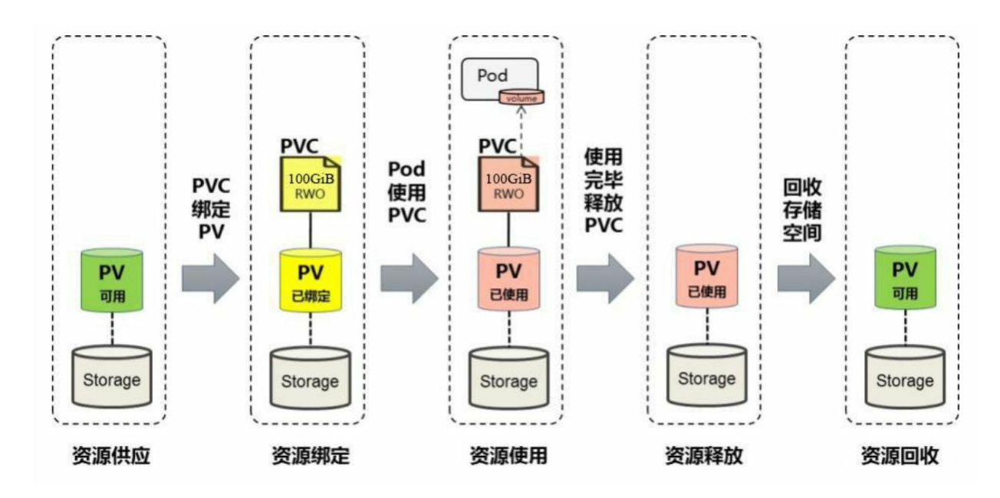

[toc]

### PV详解

#### pv yaml

```yaml
apiVersion: v1
kind: PersistentVolume
metadata:
	name: pv1
spec:
	capacity:
	  storage: 5Gi
	accessModes:
	  - ReadWriteOnce
	PersistentVolumeReclaimPolicy: Recycle
	storageClassName: slow
	nfs:
	  path: /tmp
	  server: 172.17.0.2
```

这个例子具有如下属性：5GiB存储空间，访问模式为ReadWriteOnce，存储类型为slow（要求在系统中已存在名为slow的StorageClass），回收策略为Recycle，并且后端存储类型为nfs（设置了NFS Server的IP地址和路径）


#### PV的关键配置参数

##### 1.存储能力（Capacity）

描述存储设备具备的的能力，目前仅支持对存储空间的设置（storage=xxx）

##### 2.存储卷模式（Volume Mode）

Kubernetes从1.13版本开始引入存储卷类型的设置 (volumeMode=xxx)，可选项包括Filesystem(文件系统)和Block(块 设备)，默认值为Filesystem。


##### 3.访问模式（Access Mode）

对PV进行访问模式的设置，用于描述用户的应用对存储资源的访问权限。

* ReadWriteOnce（RWO）：读写权限，并且只能被单个Node挂载。
* ReadOnlyMany（ROX）：只读权限，允许被多个Node挂载
* ReadWriteMany（RWX）：读写权限，允许被多个Node挂载 

##### 4.存储类别（Class）

PV可以设定其存储的类别，通过storageClassName参数指定一个StorageClass资源对象的名称。具有特定类别的PV只能与请求了该类别的PVC进行绑定。未设定类别的PV则只能与不请求任何类别的PVC进行绑定。


##### 5.回收策略（Reclaim Policy）

通过PV定义的persistentVolumeReclaimPolicy字段进行设置，可选型如下：

* 保留：保留数据，需要手工处理
* 回收空间：简单清除文件的操作（例如执行 rm -rf /thevolume/* 命令）
* 删除：与PV相连的后端存储完成Volume的删除操作

##### 6.挂载参数（Mount Options）


##### 7.节点亲和性（Node Affinity）

PV可以设置节点亲和性来限制只能通过某些Node访问V olume，可 以在PV定义中的nodeAffinity字段进行设置。使用这些V olume的Pod将 被调度到满足条件的Node上。


#### PV生命周期的各个阶段

某个PV在生命周期中可能处于以下4个阶段（Phase）之一：

* Available：可用状态，还未与某个PVC绑定
* Bound：已于某个PVC绑定
* Released：绑定的PVC已经删除，资源已释放，但是没有被集群回收
* Failed：自动资源回收失败


### PVC详解

pvc作为用户对存储资源的需求申请，主要包括存储空间请求、访问模式、PV选择条件和存储类别等信息的设置。

```yaml
kind: PersistentVolumeClaim
apiVersion: v1
metadata:
	name: myclaim
spec:
	accessModes:
	  - ReadWriteOnce
	resources:
	  requests:
	    storage: 8Gi
	storageClassName: slow
	selector:
	  matchLabels:
	    release: "stable"
	  matchExpressions:
	    - {key: environment, operator: In, values: [dev]}
```

以上声明的PVC具有如下属性：申请8Gi存储空间，访问模式为ReadWriteOnce， PV选择条件包含标签“release=stable”并且包含条件为“environment   In   [dev]”的标签，存储类别为“slow”（要求在系统中已存在名为slow的StorageClass）

PVC的关键配置参数如下：

* 资源请求（Resources）：描述对存储资源的请求，目前仅支持request.storage的设置，即存储空间大小
* 访问模式（Access Modes）：PVC也可以设置访问模式，用于描述用户应用对存储资源的访问权限。
* 存储卷模式（Volume Modes）：PVC也可以设置存储卷模式，用于描述希望使用的PV存储卷模式，包括文件系统和块设备。
* PV选择条件（Selector）：通过对Label Selector的设置，可使 PVC对于系统中已存在的各种PV进行筛选。系统将根据标签选出合适 的PV与该PVC进行绑定。选择条件可以使用matchLabels和 matchExpressions进行设置，如果两个字段都设置了，则Selector的逻辑 将是两组条件同时满足才能完成匹配。
* 存储类别（Class）：PVC 在定义时可以设定需要的后端存储 的类别(通过storageClassName字段指定)，以减少对后端存储特性的 详细信息的依赖。只有设置了该Class的PV才能被系统选出，并与该 PVC进行绑定。

> 注意，PVC 和 PV 都受限于 NameSpace， PVC 在选择PV 时受到NameSpace的限制，只有相同的NameSpace中的PV 才可能与 PVC 绑定。Pod在引用PVC 时同样受 NameSpace 的限制，只有相同 NameSpace中的 PVC 才能挂载到 Pod内。

### PV和PVC的生命周期

可以将PV看作可用的存储资源，PVC则是对存储资源的需求，PV和PVC的相互关系遵循如图所示的生命周期。




### PV、PVC、StorageClass之间关系

* PV一般由运维来创建，用来申请系统中的资源。

* PVC一般由开发人员自己创建，申明你需要使用的资源量，系统会帮你自动选择需要绑定的PV，或者是你指定的PV。pvc用来向pv去申请资源

* 当集群中需要很多PV时，每次都需要手动创建是一件很麻烦的事，手动创建PV是静态供给方式，而通过StorageClass来创建PV模板，进行动态供给。

  >  创建StorageClass里面需要定义PV属性比如存储类型、大小等；另外创建这种PV需要用到存储插件。
  >
  > 最终效果是，用户提交PVC，里面指定存储类型，如果符合我们定义的StorageClass，则会为其自动创建PV并进行绑定。


> 如果一个pod中包含多个容器，那么这个存储卷可以同时被所有的容器使用。
